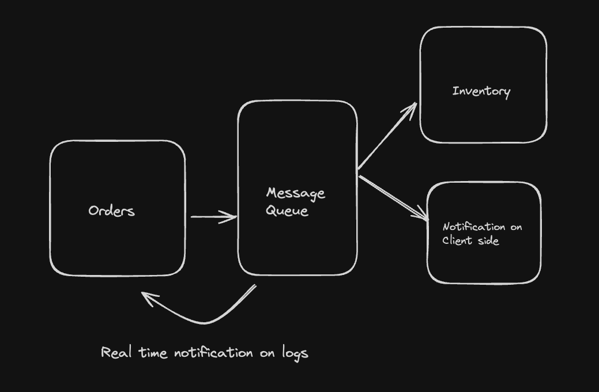

# A microservice-based ordering system

### Order Service

Receives new order and publishes them to RabbitMQ

`order-service` will publish orders to a `orders_queue`.

### Inventory service

`inventory-service` listens to `order_queue`, process the orders, and publishes to `inventory_updates`.

### Notification Service

`notification-service` listens to the `inventory_updates` queue and sends notification. 

## Workflow of the project

